********************************************************************************

::: read

*Introductie*

In deze opdracht ga je een spel maken die als doel heeft de kat zo snel mogelijk
naar de overkant te laten lopen.

:::
________________________________________________________________________________
::: program

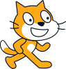{.float-right}
*begin van de opdracht*

Ga naar de Kat-sprite en maak de kat kleiner. Zet de grootte op 50.

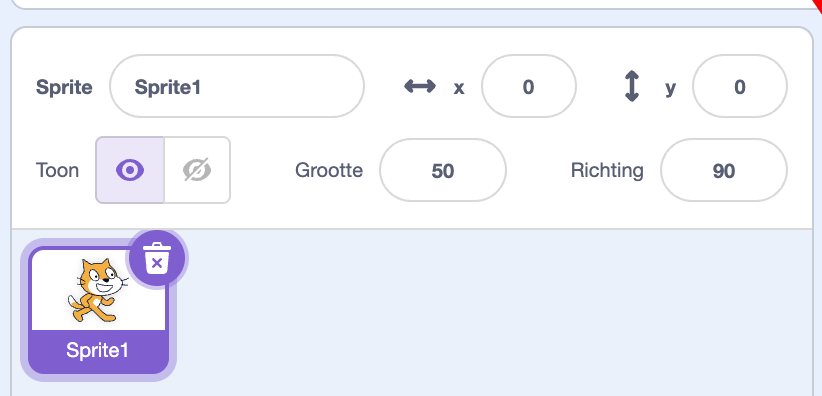

:::

________________________________________________________________________________

::: program

{.float-right}
*Zet kat links*

Als het spelletje start (Groene vlag) moet de kat links van het scherm staan.
Gebruik de onderstaande code blokken om dit mogelijk te maken.

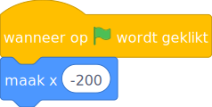

:::

________________________________________________________________________________

::: read

*Uitleg x-as*

X wijst de plek van links naar recht op het scherm.

- Helemaal links is -220
- Het midden is 0
- Helemaal rechts is 220

:::

________________________________________________________________________________

::: program

{.float-right}
*De kat laten bewegen*

We willen de kat iedere keer een stukje naar voren laten bewegen als we op de
spatiebalk drukken, dit kunnen we met de volgende extra code blokken.

Voeg de code die in het rode rechthoek staat toe aan de code
van .

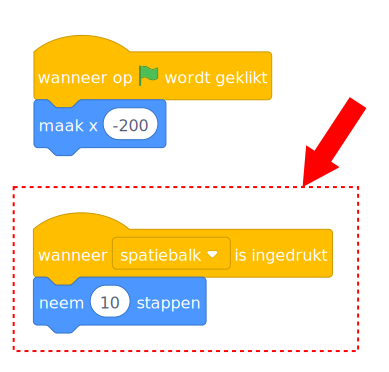

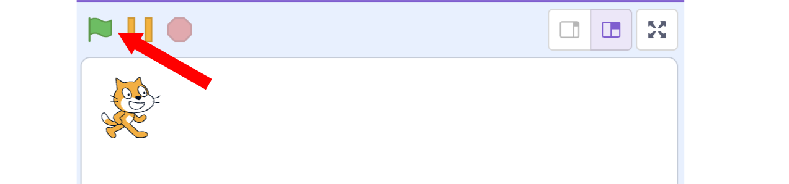{.float-right}
Probeer het uit:

- Start het programma door op de groene vlag te klikken.
- Druk een paar keer op de spatiebalk.
- Start het programma opnieuw door op de groene vlag te klikken.
- Houd de spatiebalk ingedrukt.

Snap je hoe het werkt?

:::

________________________________________________________________________________

::: read

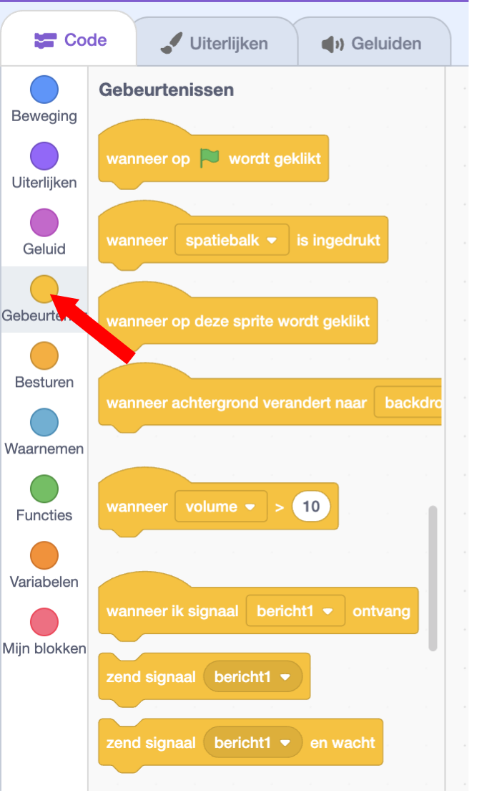{.float-right}
*Uitleg gebeurtenissen*

Een gebeurtenis is iets dat door de computer wordt herkend en waarmee je een
blok in je programma kan starten.

De gebeurtenis [wanneer op  wordt geklikt] wordt
door de computer herkend als je met je muis op de groene vlag klikt. De acties
onder het blok [wanneer op  wordt geklikt] worden
dan uitgevoerd.

De gebeurtenis [wanneer spatiebalk is ingedrukt] wordt herkend als de spatiebalk
wordt ingedrukt. De acties onder deze gebeurtenis worden dan uitgevoerd.

Er zijn nog veel meer gebeurtenissen die je kan gebruiken. Deze vind bij
gebeurtenissen in de balk links.

:::

________________________________________________________________________________

::: program

{.float-right}
*Niet vals spelen!*

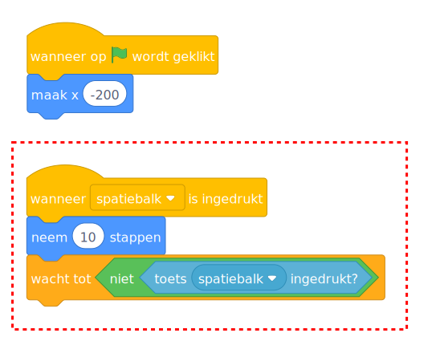{.float-right}
Om te voorkomen dat je makkelijk aan de overkant komt, willen we wachten nadat
de spatiebalk is ingedrukt, dat hij eerst weer is los gelaten.

Pas de code van  aan zoals hiernaast is in de
rode rechthoek is weergegeven.

Kijk goed naar de kleuren!

- Het blok  (donker oranje) vind je in de Besturen lijst
- Het blok  (groen) vind je in de Functies lijst
- Het blok  (licht blauwe) vind je in de Waarnemen lijst

Je moet de blokken dus in elkaar schuiven!

:::

________________________________________________________________________________

::: program

{.float-right}
*Een finishlijn toevoegen*

Maak een nieuwe Sprite (plaatje) aan en teken hier een finishlijn in.

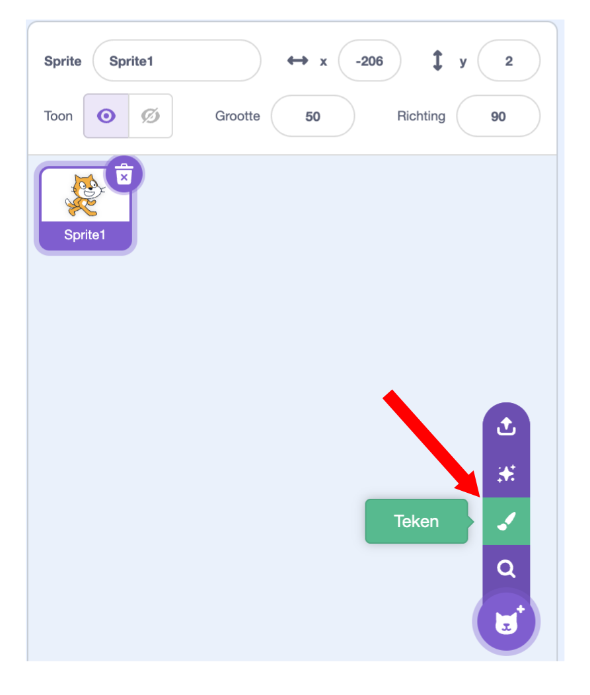
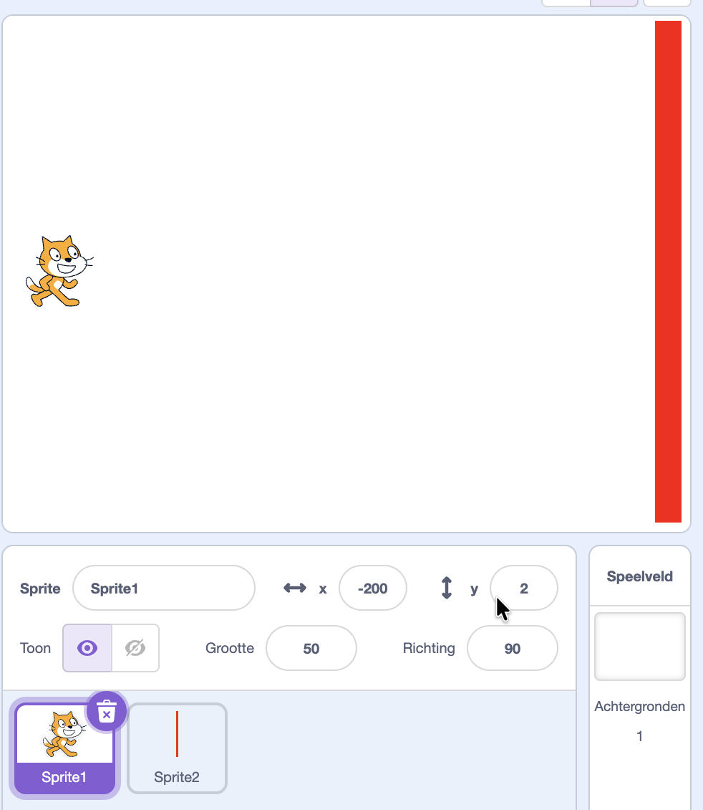

:::

________________________________________________________________________________

::: program

{.float-right}
*Spel laten stoppen als kat bij de finish is*

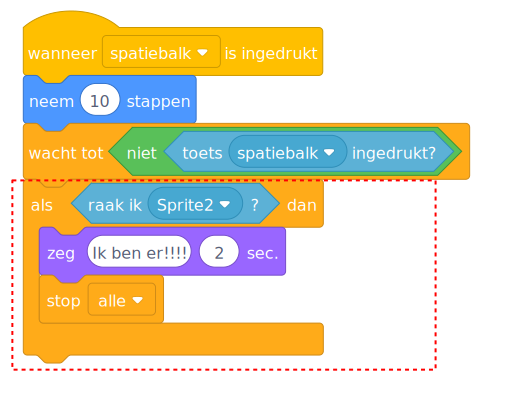{.float-right}
Als de kat nu bij de finish lijn komt moet ons spel stoppen. Dit kan je met de
volgende code blokken doen.

Voeg deze codeblokken toe aan 

Dit zorgt ervoor dat  hallo zegt als hij
<code>Sprite 2</code> raakt. <code>Sprite 2</code> is de sprite voor de
finishlijn.

:::

________________________________________________________________________________

::: read

*uitleg variabelen*

Met variabelen kan je je programma vertellen om dingen te onthouden. Een
variabele is een plekje in het geheugen van de computer waarin je een waarde kan
bewaren. Bijvoorbeeld de score of de uitkomst van een som.

## Maken van een variabele

Om een variabele te kunnen gebruiken, moet je hem eerst maken. Dit doe je door
op maak variabele te klikken.

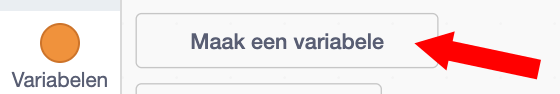

Je krijgt nu een formulier waarin je de variabele een naam kan geven. In dit
voorbeeld score.

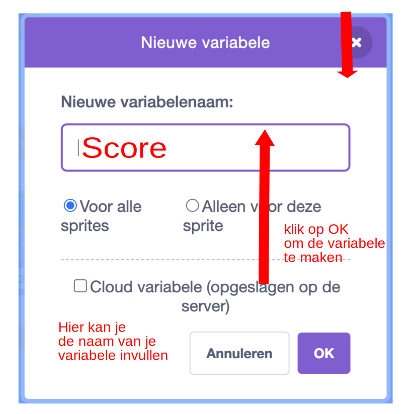

## Gebruiken van een variabele

Je krijgt nu een nieuwe bouwsteen die je kan gebruiken in je programma.

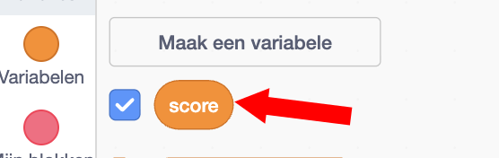
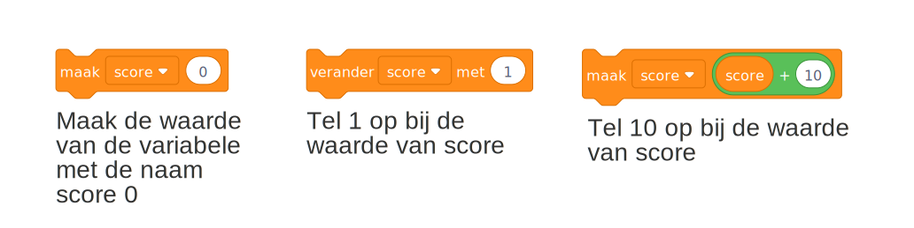

:::

________________________________________________________________________________

::: program

{.float-right}
*Maken variabele voor het bijhouden van de tijd*

Dit is een Race! dus moeten we de tijd bij gaan houden hoelang de kat erover
doet.

We hebben hiervoor een variabele nodig met de naam <code>tijd</code>. In de
uitleg over variabelen staat hoe dit moet.

Maak nu zelf een variabele met de naam tijd.

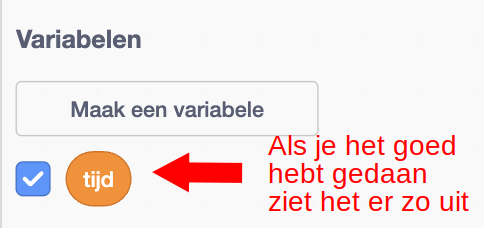

:::

________________________________________________________________________________

::: program

{.float-right}
*De tijd bijhouden*

Nu moeten we er eerst voor zorgen dat de tijd op nul wordt gezet als je het
programma start.

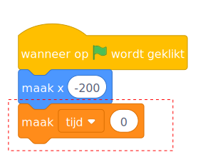

Zorg er nu voor dat de variable <code>tijd</code> elke seconde met 1 wordt
verhoogt.

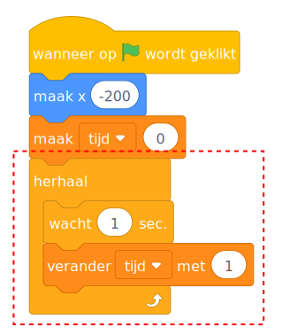

:::

________________________________________________________________________________

::: program

{.float-right}
*Score en tijd laten zien*

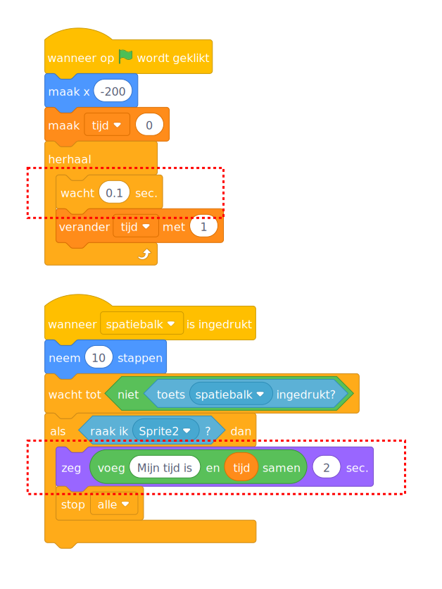{.float-right}
We gaan er nu voor zorgen dat je de score ziet als 
bij de finish komt.

De tijd meten in hele seconden is misschien niet zo leuk. Laten we de tijd
in 1/10 van een seconde gaan meten.

We willen dus de variabele tijd niet 1x per seconde verhogen, maar 10x
per seconden

Pas de code aan zoals hiernaast is weergegeven.

:::

________________________________________________________________________________

::: program

{.float-right}
*Hindernissen 1*

Laten we het wat moeilijker maken en een hindernis op de weg van de kat zetten.

Dit kan je doen door Kies een sprite. Kies een leuk plaatje uit en
maak het plaatje ook weer wat kleiner, bijvoorbeeld weer grootte 50

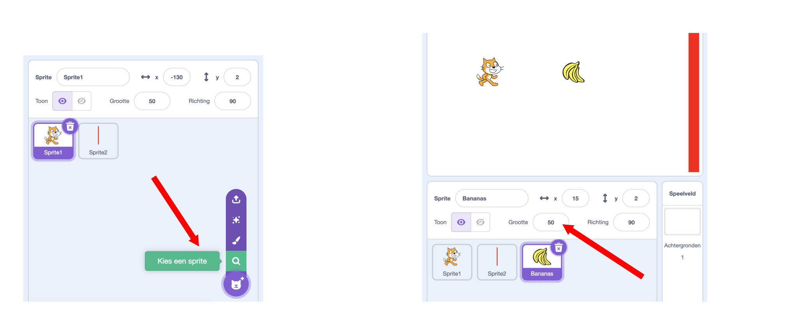

Nu moeten we ervoor zorgen dat als  de hindernis
aanraakt (de bananen) dat de kat weer terug word gezet aan het begin van het
spel. Dat kan je met de volgende commando blokken doen

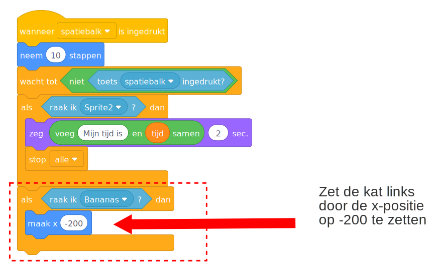

:::

________________________________________________________________________________

::: read

*Uitleg y-as*

{.float-right}
Y wijst de plek van boven naar beneden op het scherm.

- Helemaal boven is 170
- Het midden is 0
- Helemaal onder is -170

:::

________________________________________________________________________________

::: program

{.float-right}
*Omhoog bewegen*

Nu moeten we het wel mogelijk maken voor de kat om de hindernis te ontwijken.
Dit kunnen we doen door de kat omhoog en omlaag te laten gaan. Gebruik pijltje
omhoog om de kat om hoog te laten gaan. De Y Positie van de kat bepaald hoe
hoog de kat staat.

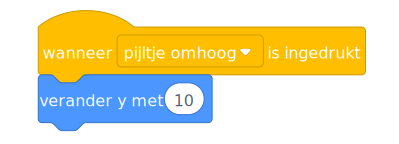

:::

________________________________________________________________________________

::: program

{.float-right}
*Omlaag bewegen*

Maak zelf een block om de kat omlaag te laten bewegen als op pijltje omlaag
wordt gedrukt.

:::

________________________________________________________________________________

::: program

{.float-right}
*Y positie op 0 zetten bij het begin*

Als het spel begint moet  op y-positie 0 staan.

Voeg het onderstaande blok toe aan je programma. Je moet zelf bepalen waar hij
moet komen.

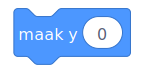

:::

________________________________________________________________________________

::: challenge 1

*Extra hindernissen*

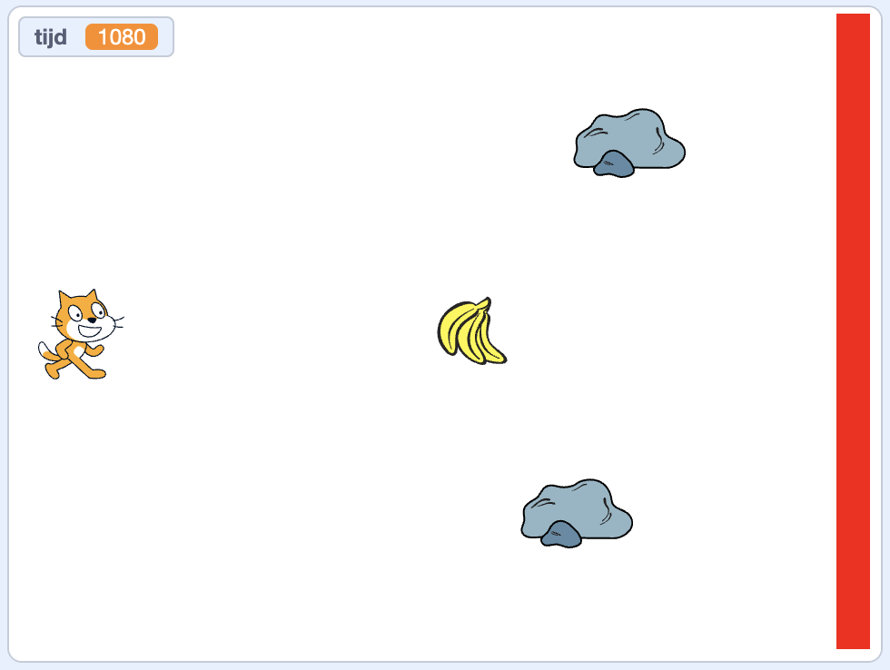{.float-right}
Maak meerdere hindernissen door rotsen toe te voegen.

Zorg er voor dat als de kat tegen
de hindernissen aanloopt hij altijd
weer terug links word geplaatst!

:::

________________________________________________________________________________

::: challenge 1

*Langzamer lopen*

Laat de kat langzamer lopen, dus dat je nog veel vaker op de spatiebalk moet
drukken om bij de finish te komen.

- Met hoeveel stappen per keer loopt de kat nu?
- Moet je het aantal stappen hoger of lager maken om de kat langzamer
  te laten lopen?

:::

________________________________________________________________________________

::: challenge 1

*Twee spelers*

Kan je dit een 2-speler spel maken?

- Maak naast de kat een andere speler in je spel
- Kopieer de code van de kat naar de andere speler

Verander de toetsen voor de spelers

- Kat (Speler 1)

  - Vooruit : Z
  - Omhoog: S
  - Omlaag: X

- Speler 2
  - Vooruit: N
  - Omhoog: K
  - Omlaag: M

- Als de 2 spelers elkaar aanraken, zet dan beide spelers terug aan het begin!

:::

________________________________________________________________________________

::: read

*Voorbeeld spel programma*

[Download](./assets/cat-race.sb3)

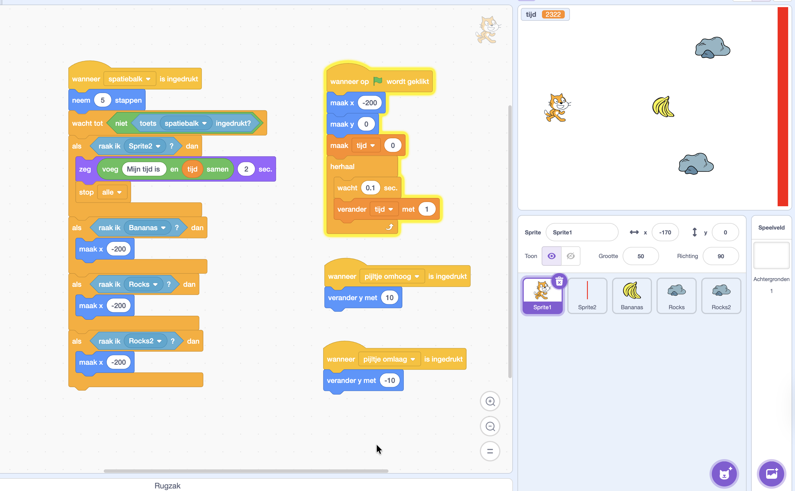

:::
